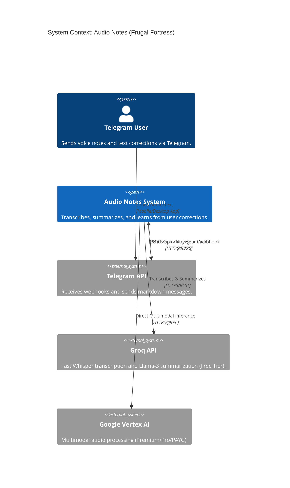
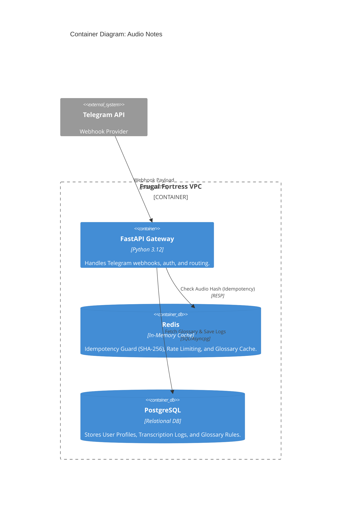
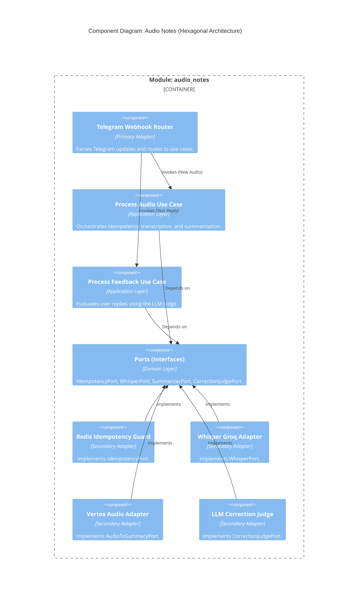

# C4 Model: Audio Notes Module

This document provides the C4 Model diagrams (Context, Container, and Component) for the Audio Notes module, highlighting the Idempotency Guard and the Nested Learning Loop.

## 1. System Context (Level 1)

## 2. Container Diagram (Level 2)

## 3. Component Diagram (Level 3 - Hexagonal Architecture)

