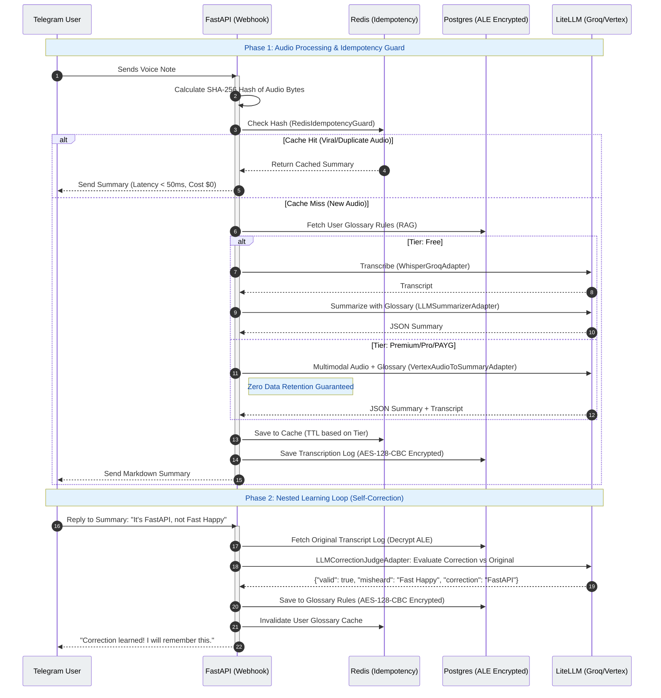

# Audio Notes — Idempotency & Nested Learning Loop

This sequence diagram illustrates the dual-path processing (Free vs Paid) and the self-correcting feedback loop (Reply-to-Correct), highlighting the strict Hexagonal Architecture boundaries and Application-Level Encryption (ALE).

