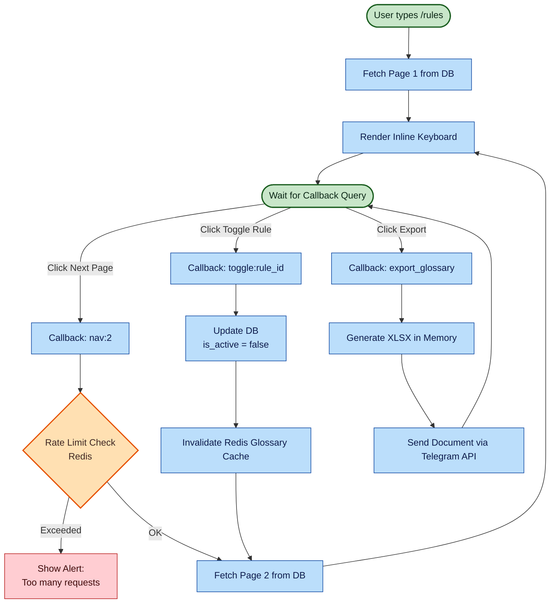

# Glossary Management — Pagination & Export

This state/sequence diagram illustrates how users manage their "Nested Learning Loop" rules directly from Telegram using inline keyboards.

> **Why XLSX in memory?** The export must not touch disk (PII safety) and Telegram supports up to 50 MB documents.
> The CSV path is preferred for smaller exports; XLSX is used when users explicitly need spreadsheet
> formulas or formatted columns.
