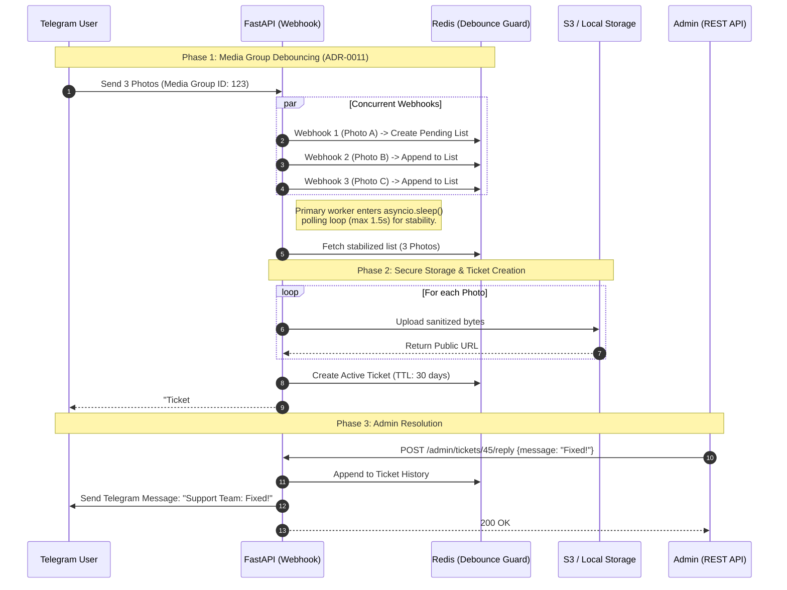

# Support Tickets — Media Group Debouncing & Admin Reply

This sequence diagram illustrates how the system handles concurrent Telegram webhooks for multiple image uploads (Albums), debounces them using Redis (ADR-0011), and allows Admins to reply via the REST API.

