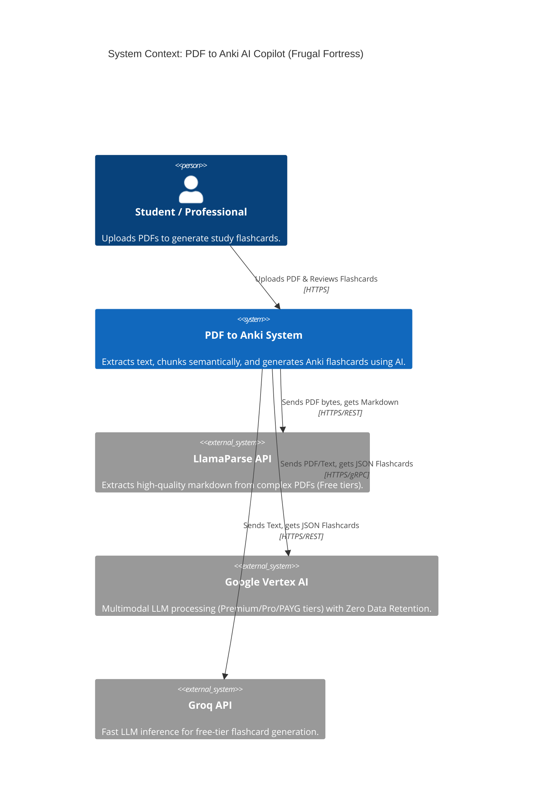
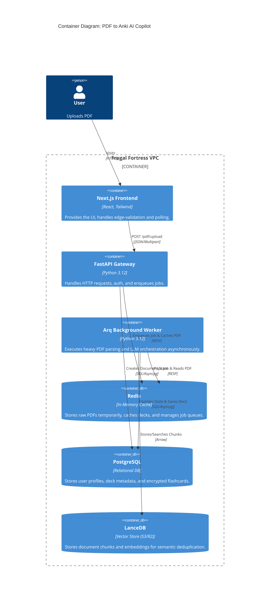
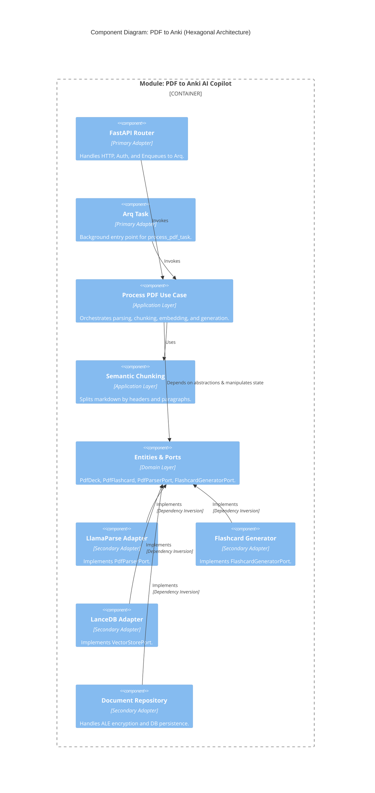

# C4 Model: PDF to Anki Module

This document provides the C4 Model diagrams (Context, Container, and Component) for the PDF to Anki AI Copilot module, highlighting the strict Hexagonal Architecture boundaries.

## 1. System Context (Level 1)
Shows how the user interacts with the system and the external dependencies.

## 2. Container Diagram (Level 2)

Shows the high-level technical containers within the Frugal Fortress monolith.

## 3. Component Diagram (Level 3 - Hexagonal Architecture)

Details the internal structure of the PDF to Anki AI Copilot module, proving the Dependency Inversion Principle.
 
