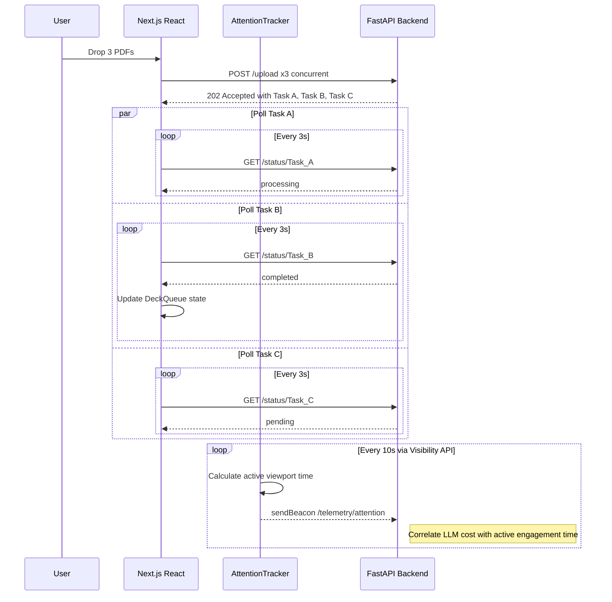

# PDF to Anki — Concurrent Polling & Telemetry
This sequence diagram shows how the Next.js frontend handles multiple asynchronous tasks simultaneously without blocking the React render cycle, while tracking user attention for FinOps ROI metrics.

