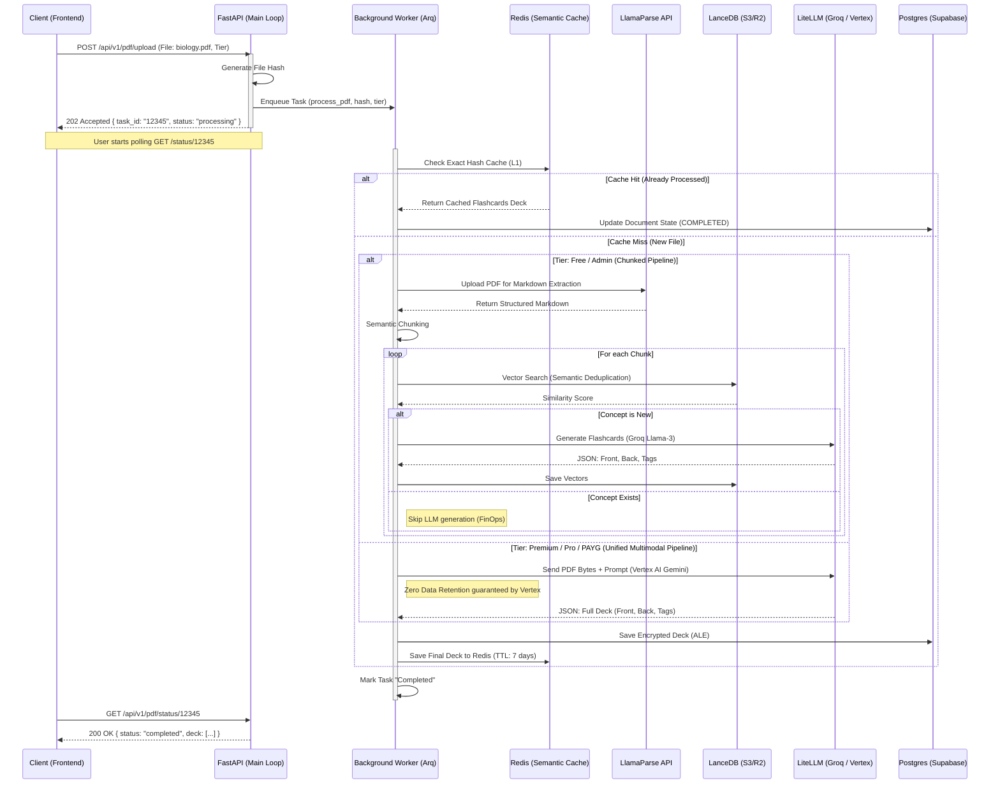

# PDF to Anki — Async RAG Flow

This sequence diagram illustrates the asynchronous processing of PDFs. It highlights the dual-pipeline architecture: Free/Admin tiers use a chunked RAG approach (LlamaParse + Groq), while Paid tiers use a direct multimodal approach (Vertex AI) for enhanced privacy and cohesion.
 

