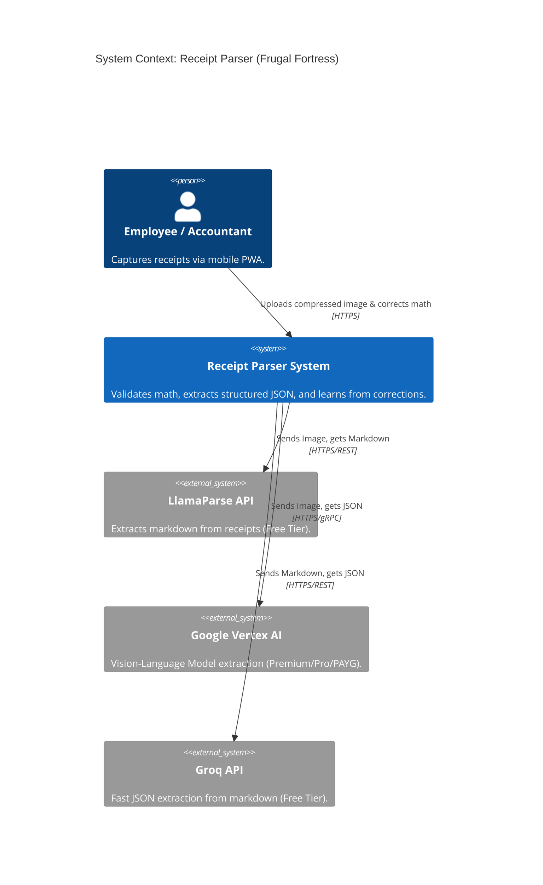
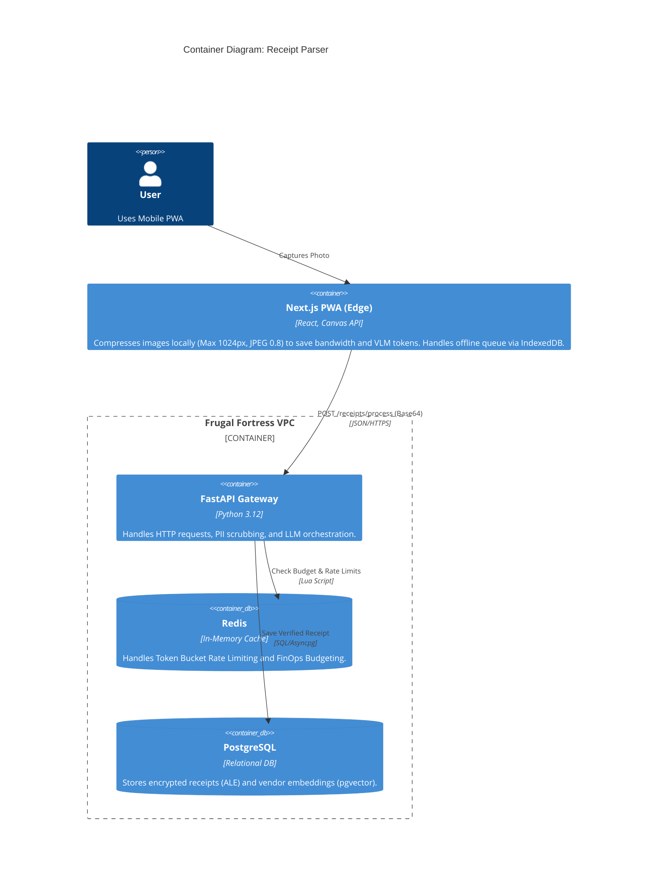
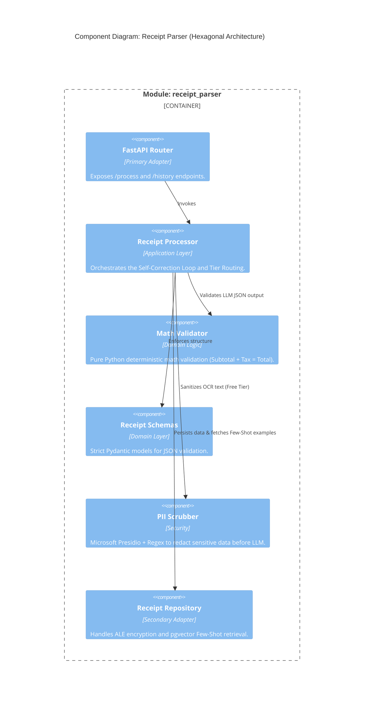

# C4 Model: Receipt Parser Module

This document provides the C4 Model diagrams for the Receipt Parser module, highlighting Edge Compute offloading and the Human-in-the-Loop (HITL) architecture.

## 1. System Context (Level 1)

## 2. Container Diagram (Level 2)

## 3. Component Diagram (Level 3 - Hexagonal Architecture)
