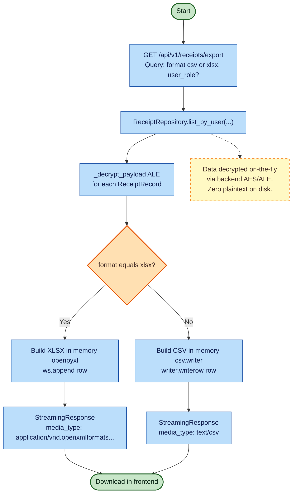

# VERA (Receipt Parser) — Export Flow (CSV & XLSX)

This flowchart demonstrates the data retrieval and export process for the `GET /api/v1/receipts/export` endpoint. It highlights how Application-Level Encryption (ALE) is decrypted on-the-fly in memory before streaming the file (CSV or Excel) to the client.

