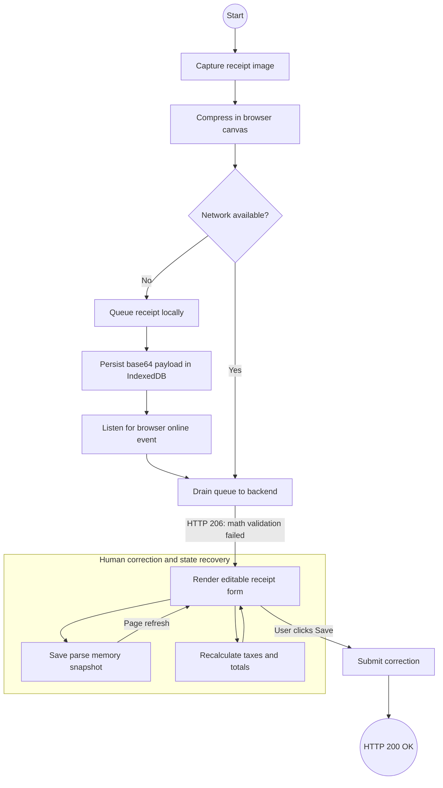

# Receipt Parser — Frontend Offline Sync & State Recovery
This state machine illustrates the PWA's resilience. It handles network drops via IndexedDB and prevents data loss during accidental page refreshes via LocalStorage state snapshots.

