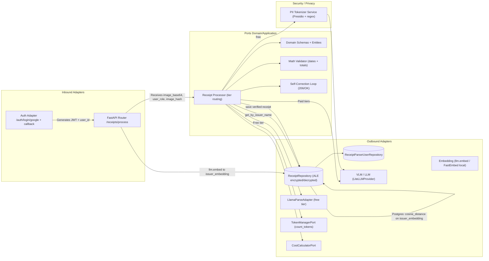
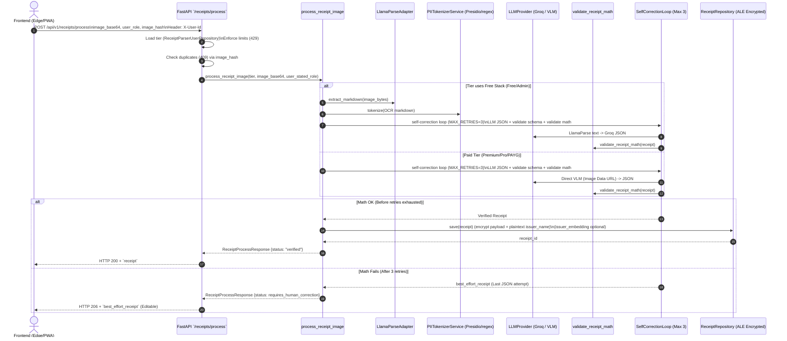
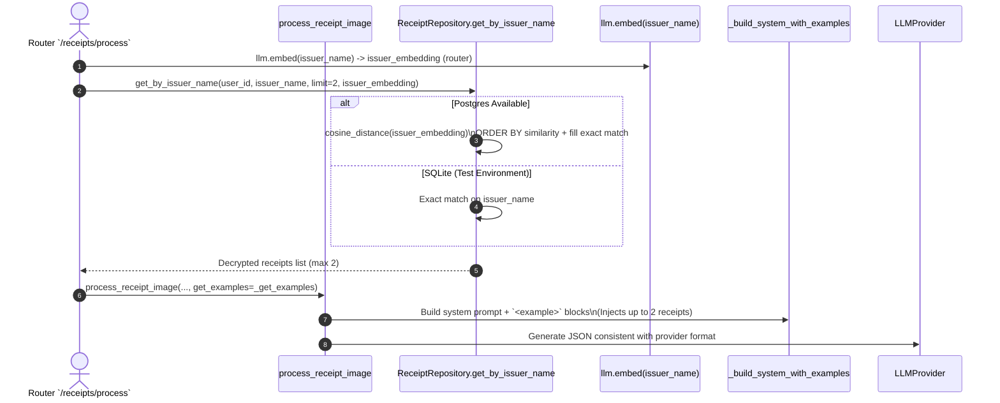
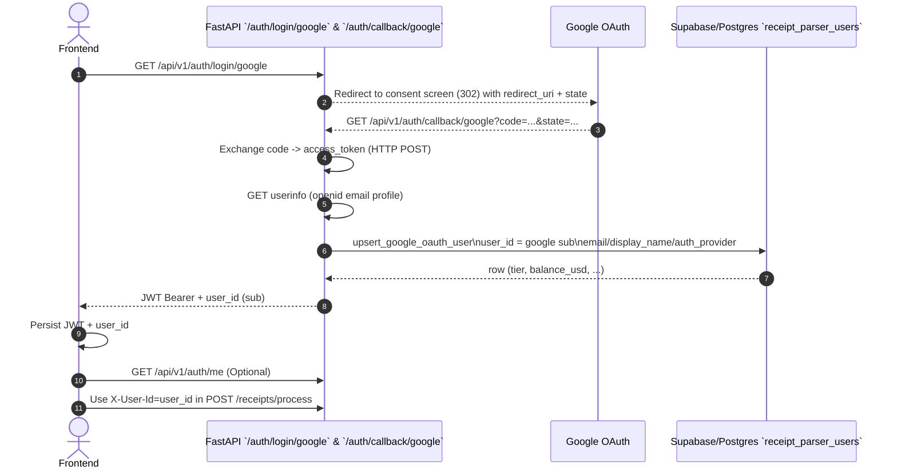

# Receipt Parser — Hexagonal Architecture & Flows

This document details the internal architecture of the Receipt Parser module, mapping the strict boundaries between the Domain, Application, and Infrastructure layers, followed by the sequence diagrams for its core operations.

## 1. Hexagonal Module Wiring

## 2. Processing Sequence (Self-Correction Loop)

## 3. Few-Shot Vendor Matching (RAG)

## 4. Authentication Flow (Google OAuth)
