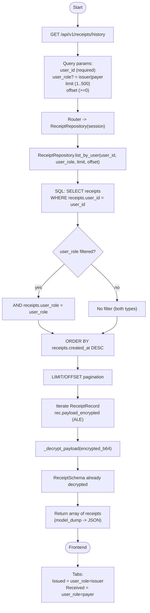

# Receipt Parser — History & Decryption Flow

This flowchart demonstrates the data retrieval process for the `GET /api/v1/receipts/history` endpoint. It highlights the Application-Level Encryption (ALE) mechanism, showing how encrypted payloads stored in PostgreSQL are decrypted on-the-fly in the application memory before being returned to the client, ensuring Zero-Trust data security at rest.

