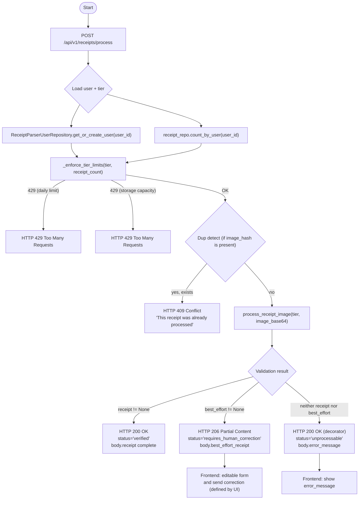

# Receipt Parser — Response Contract

This flowchart illustrates the decision tree for the `POST /api/v1/receipts/process` endpoint. It details how the system enforces tier limits, detects duplicate uploads via image hashing, and determines whether to return an `HTTP 200 OK` (Verified) or an `HTTP 206 Partial Content` (Requires Human Correction) based on the deterministic math validation.

 

