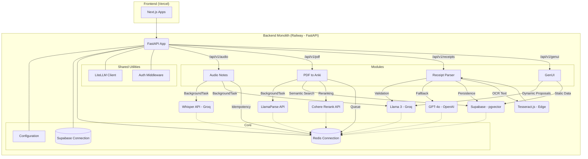

# Backend Monolith — System Context

High-level view of the Backend Monolith (Railway/FastAPI), Core, Shared Utilities, and Modules with API routes and external services.

```mermaid
graph TD
    subgraph Frontend["Frontend (Vercel)"]
        FE[Next.js Apps]
    end

    subgraph Backend_Monolith ["Backend Monolith (Railway - FastAPI)"]
        direction LR
        
        subgraph Core ["Core"]
            C_CONFIG[Configuration]
            C_DB[(Supabase Connection)]
            C_REDIS[(Redis Connection)]
        end

        subgraph Shared_Utilities ["Shared Utilities"]
            S_LLM[LiteLLM Client]
            S_SECURITY[Auth Middleware]
        end

        subgraph Modules ["Modules"]
            direction TB
            M_AUDIO[Audio Notes]
            M_PDF[PDF to Anki]
            M_RECEIPTS[Receipt Parser]
            M_GENUI[GenUI]
        end

        API_GATEWAY(FastAPI App) --- C_CONFIG
        API_GATEWAY --- C_DB
        API_GATEWAY --- C_REDIS
        API_GATEWAY --- S_LLM
        API_GATEWAY --- S_SECURITY

        API_GATEWAY -- /api/v1/audio --> M_AUDIO
        API_GATEWAY -- /api/v1/pdf --> M_PDF
        API_GATEWAY -- /api/v1/receipts --> M_RECEIPTS
        API_GATEWAY -- /api/v1/genui --> M_GENUI

        M_AUDIO -- BackgroundTask --> EXT_WHISPER(Whisper API - Groq)
        M_AUDIO -- BackgroundTask --> EXT_LLAMA(Llama 3 - Groq)
        M_AUDIO -- Idempotency --> C_REDIS

        M_PDF -- BackgroundTask --> EXT_LLAMAPARSE(LlamaParse API)
        M_PDF -- Semantic Search --> EXT_SUPABASE(Supabase - pgvector)
        M_PDF -- Reranking --> EXT_COHERE(Cohere Rerank API)
        M_PDF -- Queue --> C_REDIS

        M_RECEIPTS -- Validation --> EXT_LLAMA
        M_RECEIPTS -- Fallback --> EXT_GPT4O(GPT-4o - OpenAI)
        M_RECEIPTS -- Persistence --> EXT_SUPABASE
        M_RECEIPTS -- OCR Text --> FE_OCR(Tesseract.js - Edge)

        M_GENUI -- Dynamic Proposals --> EXT_LLAMA
        M_GENUI -- Static Data --> EXT_SUPABASE
    end

    FE --> API_GATEWAY
    FE_OCR --> M_RECEIPTS

    EXT_WHISPER -.-> C_REDIS
    EXT_LLAMA -.-> C_REDIS
    EXT_GPT4O -.-> C_REDIS
    EXT_COHERE -.-> C_REDIS
    EXT_LLAMAPARSE -.-> C_REDIS
    EXT_SUPABASE -.-> C_REDIS
```
