# Backend Monolith — System Context

High-level view of the Backend Monolith (Railway / FastAPI), Core, Shared Utilities, and Modules with API routes and external services. The diagram only references infrastructure that actually exists in `src/`.

```mermaid
graph TD
    subgraph Frontend["Frontend (Vercel)"]
        FE[Next.js Apps<br/>genui · pdf-anki · receipts]
    end

    subgraph Backend_Monolith ["Backend Monolith (Railway · FastAPI)"]
        direction LR

        subgraph Core ["Core"]
            C_CONFIG[Configuration<br/>pydantic-settings]
            C_DB[(Postgres / Supabase<br/>+ pgvector)]
            C_REDIS[(Redis<br/>cache · queue · rate)]
            C_LANCE[(LanceDB<br/>S3 / Cloudflare R2)]
        end

        subgraph Shared_Utilities ["Shared Utilities"]
            S_LLM[LiteLLM Client]
            S_AUTH[JWT / OAuth Middleware]
            S_FINOPS[FinOps Callback]
            S_OTEL[OpenTelemetry / structlog]
        end

        subgraph Modules ["Modules"]
            direction TB
            M_AUDIO[audio_notes / AURA]
            M_PDF[pdf_anki / KERA]
            M_RECEIPTS[receipt_parser / VERA]
            M_GENUI[genui]
            M_DLP[dlp_proxy<br/>local SLM PII guard]
        end

        API_GATEWAY(FastAPI App) --- C_CONFIG
        API_GATEWAY --- C_DB
        API_GATEWAY --- C_REDIS
        API_GATEWAY --- S_LLM
        API_GATEWAY --- S_AUTH
        API_GATEWAY --- S_FINOPS
        API_GATEWAY --- S_OTEL

        API_GATEWAY -- /api/v1/audio · /api/v1/telegram/webhook --> M_AUDIO
        API_GATEWAY -- /api/v1/pdf --> M_PDF
        API_GATEWAY -- /api/v1/receipts --> M_RECEIPTS
        API_GATEWAY -- /api/v1/genui --> M_GENUI
        API_GATEWAY -- /api/v1/dlp --> M_DLP

        %% Audio Notes (AURA)
        M_AUDIO -- Free tier: Whisper + Llama-3.3 --> EXT_GROQ(Groq API)
        M_AUDIO -- Paid tier: Gemini multimodal --> EXT_VERTEX(Google Vertex AI)
        M_AUDIO -- SHA-256 idempotency --> C_REDIS
        M_AUDIO -- Glossary, transcripts --> C_DB
        M_AUDIO -- Telegram delivery --> EXT_TG(Telegram Bot API)

        %% PDF to Anki (KERA)
        M_PDF -- Free tier: PDF -> markdown --> EXT_LLAMAPARSE(LlamaParse Cloud)
        M_PDF -- Free tier: flashcard gen --> EXT_GROQ
        M_PDF -- Paid tier: unified multimodal --> EXT_VERTEX
        M_PDF -- L2 semantic dedup (chunks) --> C_LANCE
        M_PDF -- Decks · users · feedback --> C_DB
        M_PDF -- L1 hash deck cache · queue --> C_REDIS

        %% Receipt Parser (VERA)
        M_RECEIPTS -- Free tier: PDF/image OCR --> EXT_LLAMAPARSE
        M_RECEIPTS -- Free tier: JSON extraction --> EXT_GROQ
        M_RECEIPTS -- Paid tier: multimodal --> EXT_VERTEX
        M_RECEIPTS -- Encrypted receipts (ALE) --> C_DB

        %% GenUI
        M_GENUI -- Dynamic proposal LLM --> EXT_GROQ
        M_GENUI -- Static project metadata --> C_DB

        %% DLP Proxy (local; no external LLM)
        M_DLP -- Local llama-cpp + Presidio --> M_DLP

        %% Auth and billing
        API_GATEWAY -- OAuth2 callback --> EXT_GOOGLE(Google OAuth2 / OIDC)
        API_GATEWAY -- Top-ups, customer portal, webhooks --> EXT_STRIPE(Stripe)
    end

    FE --> API_GATEWAY

    EXT_GROQ -.-> C_REDIS
    EXT_VERTEX -.-> C_REDIS
    EXT_LLAMAPARSE -.-> C_REDIS
```

> **Provider matrix.** Free tier: Groq (`whisper-large-v3`, `llama-3.3-70b-versatile`) + LlamaParse (PDFs / images). Paid tiers (Premium / Pro / PAYG): Google Vertex AI (`gemini-2.5-flash-lite`, `gemini-2.5-flash`, `gemini-2.5-pro`). **No OpenAI, Anthropic, or Cohere models or APIs are used**; all reranking is local ONNX (`reranker_adapter.py`). All outbound LLM calls flow through a Redis-backed circuit breaker; see [Circuit Breaker State Machine](circuit_breaker_state.md).
