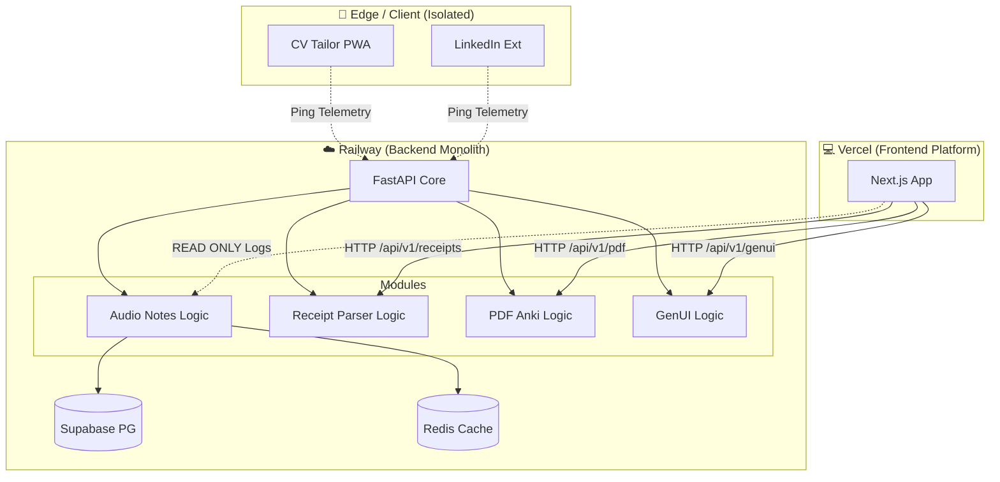

# Backend Monolith — Deployment Dependencies

Railway (Backend Monolith), Vercel (Frontend), and Edge/Client components and their relationships.

```mermaid
graph TD
    subgraph "☁️ Railway (Backend Monolith)"
        API[FastAPI Core]
        
        subgraph "Modules"
            AN[Audio Notes Logic]
            RP[Receipt Parser Logic]
            PA[PDF Anki Logic]
            GU[GenUI Logic]
        end
        
        DB[(Supabase PG)]
        Redis[(Redis Cache)]
        
        API --> AN
        API --> RP
        API --> PA
        API --> GU
        
        AN --> Redis
        AN --> DB
    end

    subgraph "💻 Vercel (Frontend Platform)"
        NextJS[Next.js App]
        NextJS -->|HTTP /api/v1/genui| GU
        NextJS -->|HTTP /api/v1/receipts| RP
        NextJS -->|HTTP /api/v1/pdf| PA
        NextJS -.->|READ ONLY Logs| AN
    end

    subgraph "📱 Edge / Client (Isolated)"
        CV[CV Tailor PWA]
        LNK[LinkedIn Ext]
        
        CV -.->|Ping Telemetry| API
        LNK -.->|Ping Telemetry| API
    end
```
