# System Context Diagram (C4 Level 1)

This diagram illustrates the **Frugal Fortress** within the enterprise ecosystem. It highlights the boundaries between the internal secure VPC and external SaaS providers actually used by the codebase.

```mermaid
flowchart TD
    %% Actors
    User["👤 Enterprise User<br/>(Web / PWA / Telegram)"]
    Admin["👨‍💻 System Admin<br/>(Admin REST API)"]

    %% Core System
    subgraph "Frugal Fortress VPC"
        API["🚀 Frugal Fortress API<br/>(FastAPI Monolith)"]
        Worker["⚙️ Async Worker<br/>(Arq + Redis)"]
        DLP["🛡️ DLP Proxy<br/>(local Llama-3.2-3B + Presidio)"]
        DB[("🗄️ PostgreSQL<br/>+ pgvector")]
        Cache[("⚡ Redis<br/>cache, queue, rate limits")]
        Lance[("🧊 LanceDB<br/>(S3 / Cloudflare R2)")]
    end

    %% External Systems
    subgraph "External SaaS"
        Groq["🤖 Groq API<br/>(Whisper + Llama-3.3 — Free tier)"]
        Vertex["🤖 Google Vertex AI<br/>(Gemini 2.5 — Paid tiers)"]
        LlamaParse["📄 LlamaParse<br/>(PDF / image OCR — Free tier)"]
        Google["🛡️ Google OAuth2<br/>(OpenID Connect)"]
        Stripe["💳 Stripe<br/>(billing & PAYG top-ups)"]
        Telegram["💬 Telegram Bot API<br/>(AURA webhook)"]
        Grafana["📊 Grafana / Loki / Tempo<br/>(observability)"]
    end

    %% Relationships
    User -->|"HTTPS / REST + JWT"| API
    User -->|"Voice / text"| Telegram
    Telegram -->|"Webhook"| API
    Admin -->|"HTTPS / REST"| API

    API -->|"OAuth2 callback"| Google
    API -->|"Sanitize prompt"| DLP
    DLP -->|"Block on PII"| API
    API -->|"Read / Write"| DB
    API -->|"Cache / queue / rate"| Cache
    API -->|"Top-ups + webhooks"| Stripe

    API -->|"Free-tier inference (CB)"| Groq
    API -->|"Paid-tier inference (CB)"| Vertex
    API -->|"PDF parsing (Free tier)"| LlamaParse

    Worker -->|"Process jobs"| Cache
    Worker -->|"Persist results"| DB
    Worker -->|"Vector dedup (chunks)"| Lance
    Worker -->|"Free-tier inference (CB)"| Groq
    Worker -->|"Paid-tier inference (CB)"| Vertex

    API -.->|"OTLP traces / JSON logs"| Grafana
    Worker -.->|"OTLP traces / JSON logs"| Grafana

    %% Styling
    style API fill:#e1f5fe,stroke:#01579b,stroke-width:2px
    style Worker fill:#fff9c4,stroke:#fbc02d,stroke-width:2px
    style DLP fill:#ffebee,stroke:#c62828,stroke-width:2px
    style Vertex fill:#f3e5f5,stroke:#7b1fa2,stroke-dasharray: 5 5
    style Groq fill:#f3e5f5,stroke:#7b1fa2,stroke-dasharray: 5 5
    style LlamaParse fill:#f3e5f5,stroke:#7b1fa2,stroke-dasharray: 5 5
    style Google fill:#f3e5f5,stroke:#7b1fa2,stroke-dasharray: 5 5
    style Stripe fill:#f3e5f5,stroke:#7b1fa2,stroke-dasharray: 5 5
    style Telegram fill:#f3e5f5,stroke:#7b1fa2,stroke-dasharray: 5 5
    style Grafana fill:#f3e5f5,stroke:#7b1fa2,stroke-dasharray: 5 5
```

> **Note (CB = Circuit Breaker):** All outbound LLM calls flow through a Redis-backed circuit breaker. On consecutive failures the breaker opens and traffic is routed to the configured fallback model (e.g., `gemini-2.5-pro` → `gemini-2.5-flash-lite`). See [Circuit Breaker State Machine](circuit_breaker_state.md).
