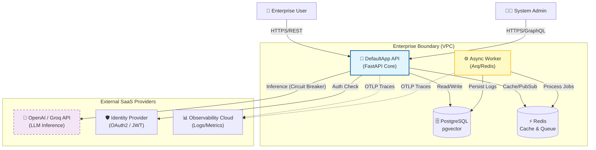

# System Context Diagram (C4 Level 1)

This diagram illustrates the **DefaultApp** within the enterprise ecosystem. It highlights the boundaries between the internal secure core and external SaaS providers.

