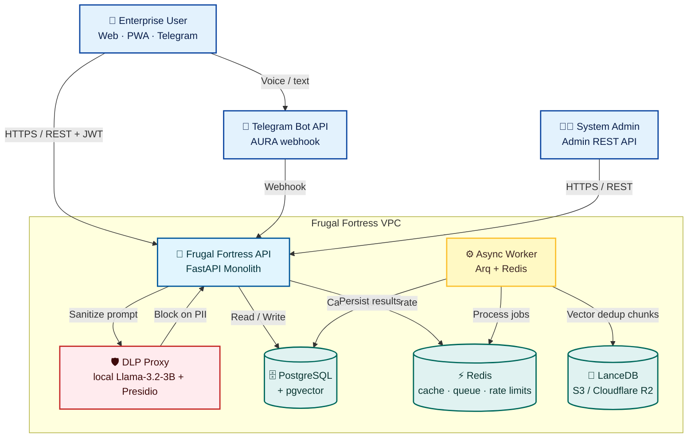
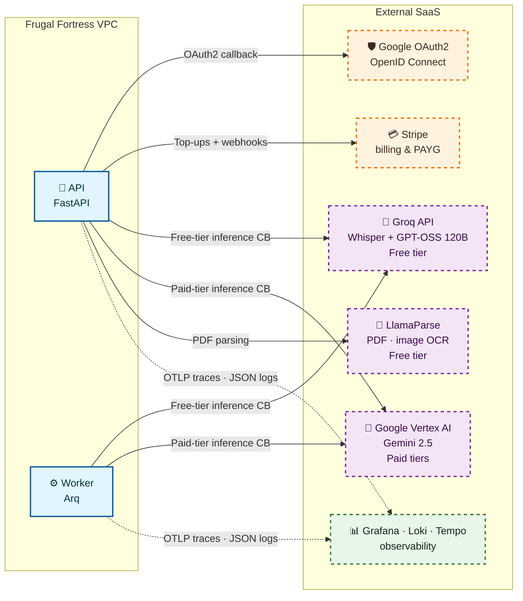

# System Context Diagram (C4 Level 1)

This diagram illustrates the **Frugal Fortress** within the enterprise ecosystem. It highlights the boundaries between the internal secure VPC and external SaaS providers actually used by the codebase.

To keep each view legible on GitHub (which renders Mermaid into a width-constrained image), the system context is split into two focused diagrams: **internal VPC** and **external SaaS integrations**.

---

## 1. Internal VPC — Actors & Core Containers

```mermaid
%%{init: {'theme':'default', 'flowchart':{'nodeSpacing':50, 'rankSpacing':70, 'curve':'basis'}}}%%
flowchart TD
    %% Actors
    User["👤 Enterprise User<br/>Web · PWA · Telegram"]
    Admin["👨‍💻 System Admin<br/>Admin REST API"]
    Telegram["💬 Telegram Bot API<br/>AURA webhook"]

    %% Core System (VPC)
    subgraph VPC ["Frugal Fortress VPC"]
        API["🚀 Frugal Fortress API<br/>FastAPI Monolith"]
        Worker["⚙️ Async Worker<br/>Arq + Redis"]
        DLP["🛡️ DLP Proxy<br/>local Llama-3.2-3B + Presidio"]
        DB[("🗄️ PostgreSQL<br/>+ pgvector")]
        Cache[("⚡ Redis<br/>cache · queue · rate limits")]
        Lance[("🧊 LanceDB<br/>S3 / Cloudflare R2")]
    end

    User -->|HTTPS / REST + JWT| API
    User -->|Voice / text| Telegram
    Telegram -->|Webhook| API
    Admin -->|HTTPS / REST| API

    API -->|Sanitize prompt| DLP
    DLP -->|Block on PII| API
    API -->|Read / Write| DB
    API -->|Cache · queue · rate| Cache

    Worker -->|Process jobs| Cache
    Worker -->|Persist results| DB
    Worker -->|Vector dedup chunks| Lance

    %% Styling — dark-mode friendly, explicit text color
    classDef actor fill:#e3f2fd,stroke:#0d47a1,stroke-width:2px,color:#0a1f4b
    classDef api fill:#e1f5fe,stroke:#01579b,stroke-width:2px,color:#01323b
    classDef worker fill:#fff9c4,stroke:#fbc02d,stroke-width:2px,color:#3e2723
    classDef dlp fill:#ffebee,stroke:#c62828,stroke-width:2px,color:#3e0a0a
    classDef store fill:#e0f2f1,stroke:#00695c,stroke-width:2px,color:#0a3531
    class User,Admin,Telegram actor
    class API api
    class Worker worker
    class DLP dlp
    class DB,Cache,Lance store
```

---

## 2. External SaaS Providers & Outbound Calls

```mermaid
%%{init: {'theme':'default', 'flowchart':{'nodeSpacing':60, 'rankSpacing':80, 'curve':'basis'}}}%%
flowchart LR
    subgraph VPC ["Frugal Fortress VPC"]
        API["🚀 API<br/>FastAPI"]
        Worker["⚙️ Worker<br/>Arq"]
    end

    subgraph SaaS ["External SaaS"]
        direction TB
        Groq["🤖 Groq API<br/>Whisper + GPT-OSS 120B<br/>Free tier"]
        Vertex["🤖 Google Vertex AI<br/>Gemini 2.5<br/>Paid tiers"]
        LlamaParse["📄 LlamaParse<br/>PDF · image OCR<br/>Free tier"]
        Google["🛡️ Google OAuth2<br/>OpenID Connect"]
        Stripe["💳 Stripe<br/>billing & PAYG"]
        Grafana["📊 Grafana · Loki · Tempo<br/>observability"]
    end

    API -->|OAuth2 callback| Google
    API -->|Top-ups + webhooks| Stripe
    API -->|Free-tier inference CB| Groq
    API -->|Paid-tier inference CB| Vertex
    API -->|PDF parsing| LlamaParse

    Worker -->|Free-tier inference CB| Groq
    Worker -->|Paid-tier inference CB| Vertex

    API -.->|OTLP traces · JSON logs| Grafana
    Worker -.->|OTLP traces · JSON logs| Grafana

    %% Styling
    classDef internal fill:#e1f5fe,stroke:#01579b,stroke-width:2px,color:#01323b
    classDef llm fill:#f3e5f5,stroke:#7b1fa2,stroke-width:2px,color:#3a0a4b,stroke-dasharray: 5 5
    classDef auth fill:#fff3e0,stroke:#ef6c00,stroke-width:2px,color:#3e2723,stroke-dasharray: 5 5
    classDef obs fill:#e8f5e9,stroke:#2e7d32,stroke-width:2px,color:#0d2818,stroke-dasharray: 5 5
    class API,Worker internal
    class Groq,Vertex,LlamaParse llm
    class Google,Stripe auth
    class Grafana obs
```

> **Note (CB = Circuit Breaker):** All outbound LLM calls flow through a Redis-backed circuit breaker. On consecutive failures the breaker opens and traffic is routed to the configured fallback model (e.g., `gemini-2.5-pro` → `gemini-2.5-flash-lite`). See [Circuit Breaker State Machine](circuit_breaker_state.md).
