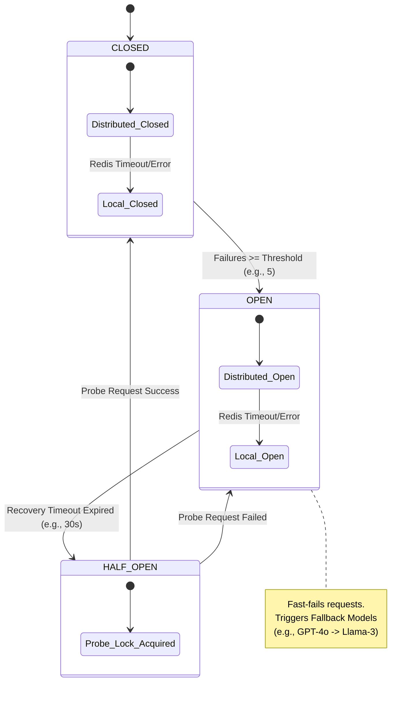

# Circuit Breaker State Machine
This state diagram shows the distributed Circuit Breaker logic. It highlights the "Fail Open" design: if the distributed cache (Redis) fails, the breaker falls back to local memory state to ensure the application doesn't crash.

