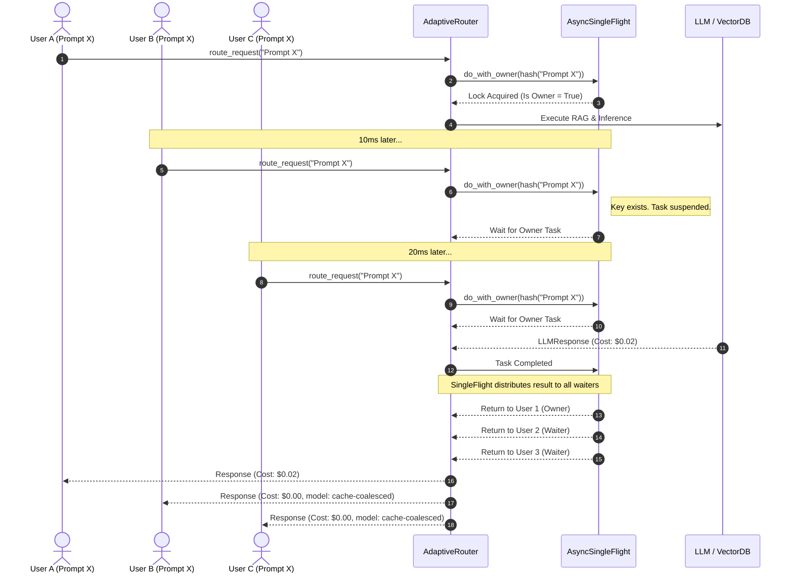

# Concurrency: Async SingleFlight Pattern
This sequence diagram illustrates how the `AsyncSingleFlight` pattern prevents "Cache Stampedes". When multiple concurrent requests ask the exact same question, only the first request (Owner) executes the heavy LLM/Retrieval logic. The others (Waiters) suspend execution and share the final result.

