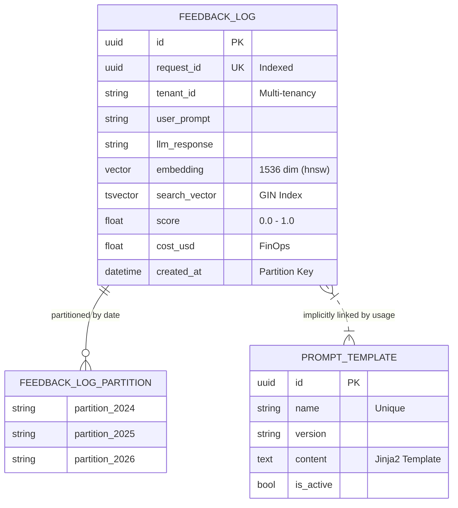

# Database Schema (ERD)

This diagram illustrates the core data structures in PostgreSQL. Note the use of **Table Partitioning** on `feedback_log` to handle high-volume interaction logs efficiently over time.

