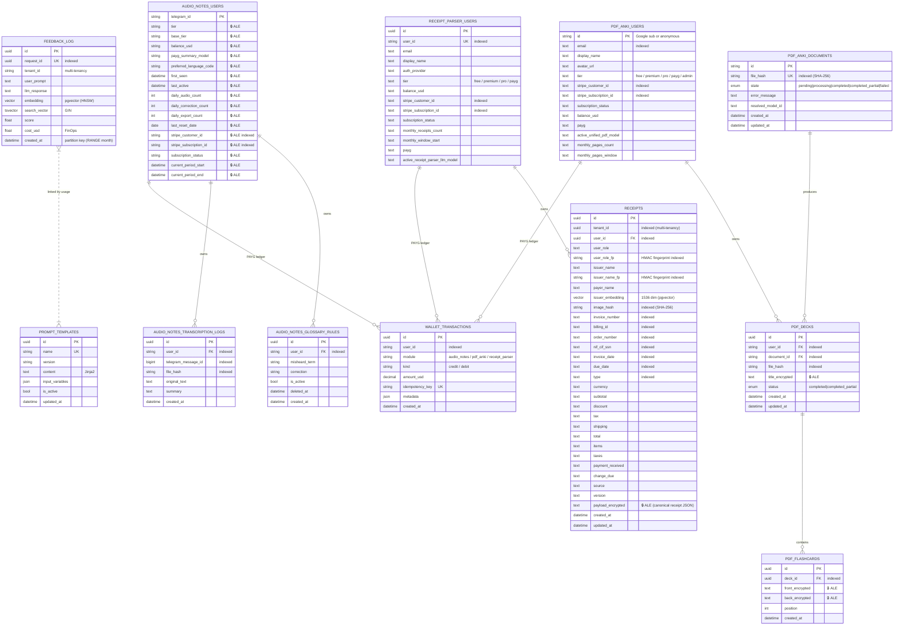

# Database Schema (ERD)

This diagram covers every SQLAlchemy ORM entity registered against `Base` in the backend. Entities are grouped by bounded context. Sensitive columns are encrypted at rest via the Fernet-based ALE pipeline (`src/app/security/encryption.py`); these are marked **🔒** below.

## Companion Stores (Not in this ERD)

The following stores are **not** SQLAlchemy entities and therefore do not appear in the diagram, but are part of the overall persistence story:

| Store | Backend | Purpose |
|---|---|---|
| `pdf_anki_chunks` | LanceDB (S3 / Cloudflare R2) | Per-chunk embeddings for L2 semantic deduplication. See [ADR-0009](../../adr/0009-postgres-pgvector-vs-pinecone.md). |
| `audio_processed:{hash}` | Redis | Content-addressable idempotency cache for audio. See [ADR-0013](../../adr/0013-sha256-idempotency-guard.md). |
| `pdf:deck:{file_hash}:{sig}` | Redis | Content-addressable cache for fully generated PDF decks. |
| Arq queue (`arq:queue:*`) | Redis | Background job queue (`process_pdf_task`, prune jobs, telegram delivery). |
| Active support tickets (`ticket:active:{ticket_id}`) | Redis | In-flight Telegram support conversation context. |
| Support attachments | S3-compatible object storage (or local disk in dev) | Files referenced by support tickets. |

## Key Conventions

* **Multi-tenancy:** Every read/write through repositories enforces `WHERE tenant_id = :tenant_id`. The only deliberate exception is the **content-addressable idempotency caches** (`audio_processed:{hash}`, `pdf:deck:{file_hash}:{sig}`) — see [CORE_INVARIANTS §2.2](../../architecture/CORE_INVARIANTS.md) and [ADR-0013](../../adr/0013-sha256-idempotency-guard.md).
* **HMAC fingerprints (`*_fp`):** Sensitive fields stored as ALE ciphertext are accompanied by deterministic HMAC-SHA256 fingerprints to keep them queryable without leaking plaintext.
* **Vector indices:** `feedback_log.embedding` and `receipts.issuer_embedding` use `pgvector` with HNSW. See [ADR-0002](../../adr/0002-use-pgvector.md).
* **Partitioning:** `feedback_log` is partitioned by month (`RANGE (created_at)`) to maintain sub-millisecond retrieval.
