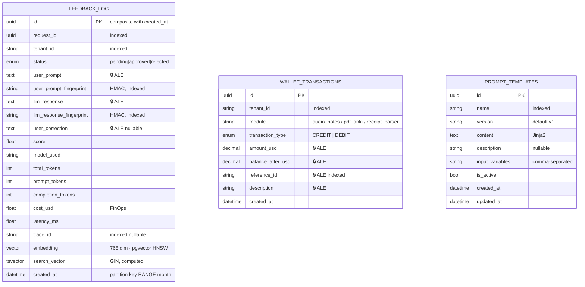
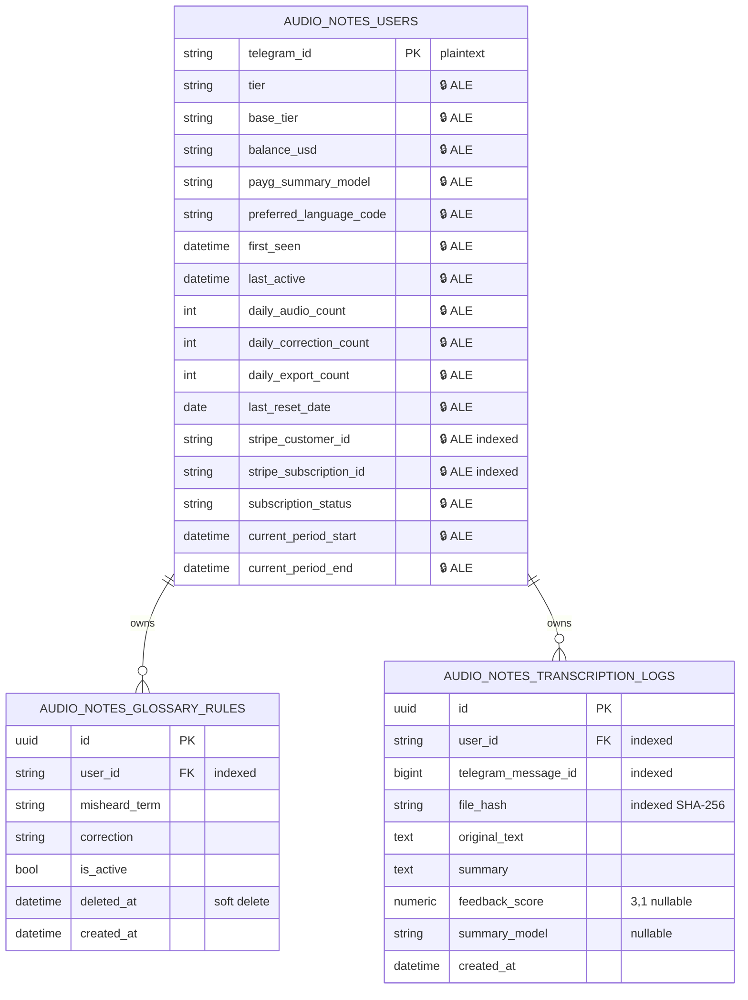
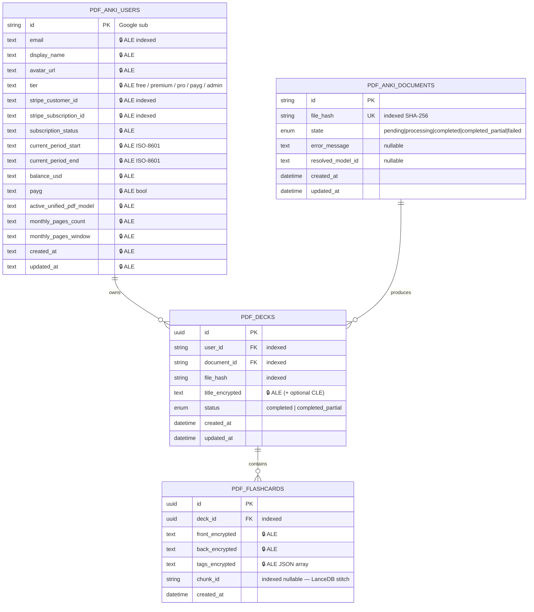
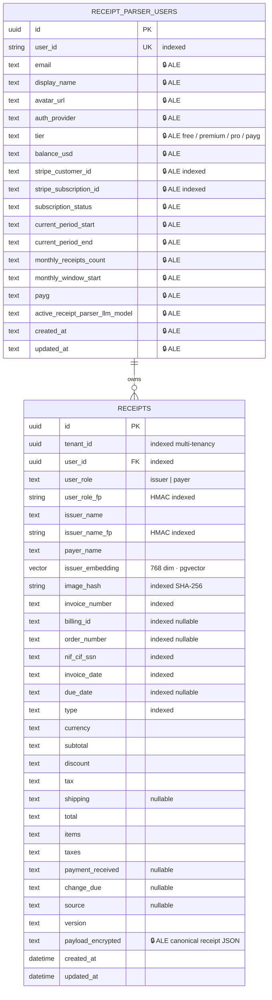
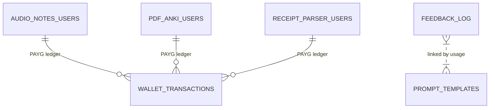

# Database Schema (ERD)

This document covers every SQLAlchemy ORM entity registered against `Base` in the backend. Entities are grouped by bounded context. Sensitive columns are encrypted at rest via the Fernet-based ALE pipeline (`src/app/security/encryption.py`, `*_ale.py`); these are marked **🔒** below.

The schema is split into focused diagrams (one per bounded context) so each entity stays legible on GitHub:

1. **Cross-cutting** — `feedback_log`, `wallet_transactions`, `prompt_templates`
2. **audio_notes (AURA)** — `audio_notes_*`
3. **pdf_anki (KERA)** — `pdf_anki_*`, `pdf_decks`, `pdf_flashcards`
4. **receipt_parser (VERA)** — `receipt_parser_users`, `receipts`
5. **Cross-context relationships** — wallet ledger fan-in

---

## 1. Cross-cutting Entities

`feedback_log` is partitioned by month (RANGE on `created_at`) with HNSW + GIN indexes. `wallet_transactions` is an append-only PAYG ledger shared by all modules.

```mermaid
%%{init: {'theme':'default', 'er':{'layoutDirection':'TB'}}}%%
erDiagram
    FEEDBACK_LOG {
        uuid id PK "composite with created_at"
        uuid request_id "indexed"
        string tenant_id "indexed"
        enum status "pending|approved|rejected"
        text user_prompt "🔒 ALE"
        string user_prompt_fingerprint "HMAC, indexed"
        text llm_response "🔒 ALE"
        string llm_response_fingerprint "HMAC, indexed"
        text user_correction "🔒 ALE nullable"
        float score
        string model_used
        int total_tokens
        int prompt_tokens
        int completion_tokens
        float cost_usd "FinOps"
        float latency_ms
        string trace_id "indexed nullable"
        vector embedding "768 dim · pgvector HNSW"
        tsvector search_vector "GIN, computed"
        datetime created_at "partition key RANGE month"
    }

    WALLET_TRANSACTIONS {
        uuid id PK
        string tenant_id "indexed"
        string module "audio_notes / pdf_anki / receipt_parser"
        enum transaction_type "CREDIT | DEBIT"
        decimal amount_usd "🔒 ALE"
        decimal balance_after_usd "🔒 ALE"
        string reference_id "🔒 ALE indexed"
        string description "🔒 ALE"
        datetime created_at
    }

    PROMPT_TEMPLATES {
        uuid id PK
        string name "indexed"
        string version "default v1"
        text content "Jinja2"
        string description "nullable"
        string input_variables "comma-separated"
        bool is_active
        datetime created_at
        datetime updated_at
    }
```

---

## 2. Module: `audio_notes` (AURA) — `_TABLE_PREFIX = "audio_notes_"`

Almost the entire `audio_notes_users` row is Fernet-encrypted because `telegram_id` is the only column needed for plaintext `WHERE` lookups.

```mermaid
%%{init: {'theme':'default', 'er':{'layoutDirection':'TB'}}}%%
erDiagram
    AUDIO_NOTES_USERS {
        string telegram_id PK "plaintext"
        string tier "🔒 ALE"
        string base_tier "🔒 ALE"
        string balance_usd "🔒 ALE"
        string payg_summary_model "🔒 ALE"
        string preferred_language_code "🔒 ALE"
        datetime first_seen "🔒 ALE"
        datetime last_active "🔒 ALE"
        int daily_audio_count "🔒 ALE"
        int daily_correction_count "🔒 ALE"
        int daily_export_count "🔒 ALE"
        date last_reset_date "🔒 ALE"
        string stripe_customer_id "🔒 ALE indexed"
        string stripe_subscription_id "🔒 ALE indexed"
        string subscription_status "🔒 ALE"
        datetime current_period_start "🔒 ALE"
        datetime current_period_end "🔒 ALE"
    }

    AUDIO_NOTES_GLOSSARY_RULES {
        uuid id PK
        string user_id FK "indexed"
        string misheard_term
        string correction
        bool is_active
        datetime deleted_at "soft delete"
        datetime created_at
    }

    AUDIO_NOTES_TRANSCRIPTION_LOGS {
        uuid id PK
        string user_id FK "indexed"
        bigint telegram_message_id "indexed"
        string file_hash "indexed SHA-256"
        text original_text
        text summary
        numeric feedback_score "3,1 nullable"
        string summary_model "nullable"
        datetime created_at
    }

    AUDIO_NOTES_USERS ||--o{ AUDIO_NOTES_GLOSSARY_RULES : "owns"
    AUDIO_NOTES_USERS ||--o{ AUDIO_NOTES_TRANSCRIPTION_LOGS : "owns"
```

---

## 3. Module: `pdf_anki` (KERA)

`pdf_anki_documents` tracks async-pipeline state. `pdf_decks` + `pdf_flashcards` hold ALE-encrypted user content. Per-chunk embeddings live in LanceDB (see Companion Stores below).

```mermaid
%%{init: {'theme':'default', 'er':{'layoutDirection':'TB'}}}%%
erDiagram
    PDF_ANKI_USERS {
        string id PK "Google sub"
        text email "🔒 ALE indexed"
        text display_name "🔒 ALE"
        text avatar_url "🔒 ALE"
        text tier "🔒 ALE free / premium / pro / payg / admin"
        text stripe_customer_id "🔒 ALE indexed"
        text stripe_subscription_id "🔒 ALE indexed"
        text subscription_status "🔒 ALE"
        text current_period_start "🔒 ALE ISO-8601"
        text current_period_end "🔒 ALE ISO-8601"
        text balance_usd "🔒 ALE"
        text payg "🔒 ALE bool"
        text active_unified_pdf_model "🔒 ALE"
        text monthly_pages_count "🔒 ALE"
        text monthly_pages_window "🔒 ALE"
        text created_at "🔒 ALE"
        text updated_at "🔒 ALE"
    }

    PDF_ANKI_DOCUMENTS {
        string id PK
        string file_hash UK "indexed SHA-256"
        enum state "pending|processing|completed|completed_partial|failed"
        text error_message "nullable"
        text resolved_model_id "nullable"
        datetime created_at
        datetime updated_at
    }

    PDF_DECKS {
        uuid id PK
        string user_id FK "indexed"
        string document_id FK "indexed"
        string file_hash "indexed"
        text title_encrypted "🔒 ALE (+ optional CLE)"
        enum status "completed | completed_partial"
        datetime created_at
        datetime updated_at
    }

    PDF_FLASHCARDS {
        uuid id PK
        uuid deck_id FK "indexed"
        text front_encrypted "🔒 ALE"
        text back_encrypted "🔒 ALE"
        text tags_encrypted "🔒 ALE JSON array"
        string chunk_id "indexed nullable — LanceDB stitch"
        datetime created_at
    }

    PDF_ANKI_USERS ||--o{ PDF_DECKS : "owns"
    PDF_ANKI_DOCUMENTS ||--o{ PDF_DECKS : "produces"
    PDF_DECKS ||--o{ PDF_FLASHCARDS : "contains"
```

---

## 4. Module: `receipt_parser` (VERA)

`receipts.payload_encrypted` holds the canonical, validated receipt JSON; the un-encrypted columns are HMAC fingerprints (`*_fp`) and quasi-identifiers used for indexed lookups (e.g. invoice number, dates). Vector embedding is 768-dim (FastEmbed local ONNX).

```mermaid
%%{init: {'theme':'default', 'er':{'layoutDirection':'TB'}}}%%
erDiagram
    RECEIPT_PARSER_USERS {
        uuid id PK
        string user_id UK "indexed"
        text email "🔒 ALE"
        text display_name "🔒 ALE"
        text avatar_url "🔒 ALE"
        text auth_provider "🔒 ALE"
        text tier "🔒 ALE free / premium / pro / payg"
        text balance_usd "🔒 ALE"
        text stripe_customer_id "🔒 ALE indexed"
        text stripe_subscription_id "🔒 ALE indexed"
        text subscription_status "🔒 ALE"
        text current_period_start "🔒 ALE"
        text current_period_end "🔒 ALE"
        text monthly_receipts_count "🔒 ALE"
        text monthly_window_start "🔒 ALE"
        text payg "🔒 ALE"
        text active_receipt_parser_llm_model "🔒 ALE"
        text created_at "🔒 ALE"
        text updated_at "🔒 ALE"
    }

    RECEIPTS {
        uuid id PK
        uuid tenant_id "indexed multi-tenancy"
        uuid user_id FK "indexed"
        text user_role "issuer | payer"
        string user_role_fp "HMAC indexed"
        text issuer_name
        string issuer_name_fp "HMAC indexed"
        text payer_name
        vector issuer_embedding "768 dim · pgvector"
        string image_hash "indexed SHA-256"
        text invoice_number "indexed"
        text billing_id "indexed nullable"
        text order_number "indexed nullable"
        text nif_cif_ssn "indexed"
        text invoice_date "indexed"
        text due_date "indexed nullable"
        text type "indexed"
        text currency
        text subtotal
        text discount
        text tax
        text shipping "nullable"
        text total
        text items
        text taxes
        text payment_received "nullable"
        text change_due "nullable"
        text source "nullable"
        text version
        text payload_encrypted "🔒 ALE canonical receipt JSON"
        datetime created_at
        datetime updated_at
    }

    RECEIPT_PARSER_USERS ||--o{ RECEIPTS : "owns"
```

---

## 5. Cross-context: PAYG Wallet Ledger

The `wallet_transactions` table is shared across every monetised module. Each module's user table fans into the same append-only ledger via `module` + `tenant_id` filtering.

```mermaid
%%{init: {'theme':'default', 'er':{'layoutDirection':'LR'}}}%%
erDiagram
    AUDIO_NOTES_USERS ||--o{ WALLET_TRANSACTIONS : "PAYG ledger"
    PDF_ANKI_USERS ||--o{ WALLET_TRANSACTIONS : "PAYG ledger"
    RECEIPT_PARSER_USERS ||--o{ WALLET_TRANSACTIONS : "PAYG ledger"
    FEEDBACK_LOG }|..|{ PROMPT_TEMPLATES : "linked by usage"
```

---

## Companion Stores (Not in this ERD)

The following stores are **not** SQLAlchemy entities and therefore do not appear in the diagram, but are part of the overall persistence story:

| Store | Backend | Purpose |
|---|---|---|
| `pdf_anki_chunks` | LanceDB (S3 / Cloudflare R2) | Per-chunk embeddings for L2 semantic deduplication. See [ADR-0009](../../adr/0009-postgres-pgvector-vs-pinecone.md). |
| `audio_processed:{hash}` | Redis | Content-addressable idempotency cache for audio. See [ADR-0013](../../adr/0013-sha256-idempotency-guard.md). |
| `pdf:deck:{file_hash}:{sig}` | Redis | Content-addressable cache for fully generated PDF decks. |
| Arq queue (`arq:queue:*`) | Redis | Background job queue (`process_pdf_task`, prune jobs, telegram delivery). |
| Active support tickets (`ticket:active:{ticket_id}`) | Redis | In-flight Telegram support conversation context. |
| Support attachments | S3-compatible object storage (or local disk in dev) | Files referenced by support tickets. |

---

## Key Conventions

* **Multi-tenancy:** Every read/write through repositories enforces `WHERE tenant_id = :tenant_id`. The only deliberate exception is the **content-addressable idempotency caches** (`audio_processed:{hash}`, `pdf:deck:{file_hash}:{sig}`) — see [CORE_INVARIANTS §2.2](../../architecture/CORE_INVARIANTS.md) and [ADR-0013](../../adr/0013-sha256-idempotency-guard.md).
* **HMAC fingerprints (`*_fp`):** Sensitive fields stored as ALE ciphertext are accompanied by deterministic HMAC-SHA256 fingerprints to keep them queryable without leaking plaintext.
* **Vector indices:** `feedback_log.embedding` (768) and `receipts.issuer_embedding` (768) use `pgvector` with HNSW. See [ADR-0002](../../adr/0002-use-pgvector.md).
* **Partitioning:** `feedback_log` is partitioned by month (`RANGE (created_at)`) to maintain sub-millisecond retrieval.
* **ALE Type Decorators:** Encryption is transparent at the ORM layer via `EncryptedString`, `EncryptedInteger`, `EncryptedDate`, `EncryptedDatetime`, `EncryptedDecimal`. Application code only ever sees plaintext Python values.
