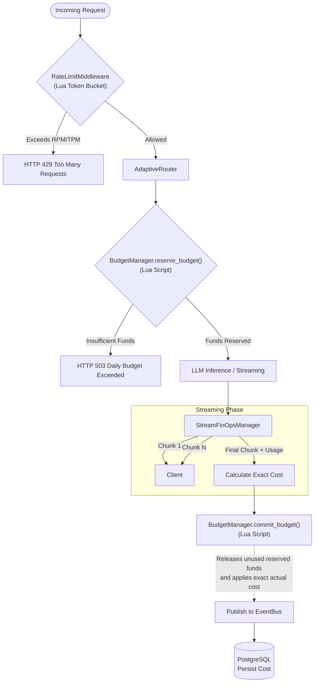

# FinOps & Token Economy Lifecycle

This flowchart details the two-phase commit process for budget management and rate limiting using atomic Lua scripts in Redis.

```mermaid
flowchart TD
    Start([Incoming Request]) --> RL{"RateLimitMiddleware<br/>(Lua Token Bucket)"}

    RL -->|Exceeds RPM/TPM| Err429["HTTP 429 Too Many Requests"]
    RL -->|Allowed| Router["AdaptiveRouter"]

    Router --> Reserve{"BudgetManager.reserve_budget()<br/>(Lua Script)"}
    Reserve -->|Insufficient Funds| Err503["HTTP 503 Daily Budget Exceeded"]
    Reserve -->|Funds Reserved| Inference["LLM Inference / Streaming"]

    Inference --> StreamMgr["StreamFinOpsManager"]

    subgraph Streaming Phase
        StreamMgr -->|Chunk 1| Client
        StreamMgr -->|Chunk N| Client
        StreamMgr -->|Final Chunk + Usage| Calc["Calculate Exact Cost"]
    end

    Calc --> Commit["BudgetManager.commit_budget()<br/>(Lua Script)"]

    Commit -.->|Releases unused reserved funds<br/>and applies exact actual cost| Worker["Publish to EventBus"]
    Worker --> DB[("PostgreSQL<br/>Persist Cost")]
```