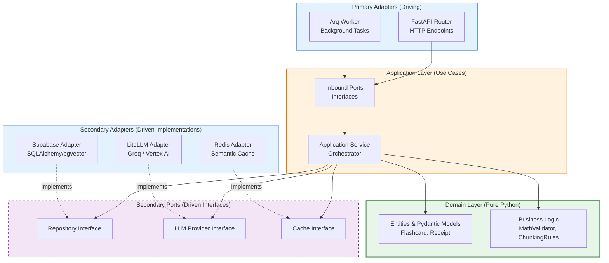

# Hexagonal Module — Ports & Adapters

Internal structure of a module: Primary Adapters (REST, Worker), Application Layer, Domain, Secondary Ports, and Secondary Adapters.

```mermaid
graph TD
    subgraph Primary_Adapters ["Primary Adapters (Driving)"]
        Router[FastAPI Router\nHTTP Endpoints]
        Worker[Arq Worker\nBackground Tasks]
    end

    subgraph Application_Layer["Application Layer (Use Cases)"]
        Service[Application Service\nOrchestrator]
        PortIn[Inbound Ports\nInterfaces]
    end

    subgraph Domain_Layer ["Domain Layer (Pure Python)"]
        Entities[Entities & Pydantic Models\nFlashcard, Receipt]
        Logic[Business Logic\nMathValidator, ChunkingRules]
    end

    subgraph Secondary_Ports ["Secondary Ports (Driven Interfaces)"]
        RepoPort[Repository Interface]
        LLMPort[LLM Provider Interface]
        CachePort[Cache Interface]
    end

    subgraph Secondary_Adapters ["Secondary Adapters (Driven Implementations)"]
        Supabase[Supabase Adapter\nSQLAlchemy/pgvector]
        LiteLLM[LiteLLM Adapter\nGroq / Vertex AI]
        Redis[Redis Adapter\nSemantic Cache]
    end

    %% Flow of Control
    Router --> PortIn
    Worker --> PortIn
    PortIn --> Service
    Service --> Entities
    Service --> Logic
    
    Service --> RepoPort
    Service --> LLMPort
    Service --> CachePort

    %% Dependency Inversion (Adapters implement Ports)
    Supabase -.->|Implements| RepoPort
    LiteLLM -.->|Implements| LLMPort
    Redis -.->|Implements| CachePort

    %% Styling for clarity
    style Domain_Layer fill:#e8f5e9,stroke:#2e7d32,stroke-width:2px,color:#333333
    style Application_Layer fill:#fff3e0,stroke:#ef6c00,stroke-width:2px,color:#333333
    style Primary_Adapters fill:#e3f2fd,stroke:#1565c0,color:#333333
    style Secondary_Adapters fill:#e3f2fd,stroke:#1565c0,color:#333333
    style Secondary_Ports fill:#f3e5f5,stroke:#6a1b9a,stroke-dasharray: 5 5,color:#333333
```
