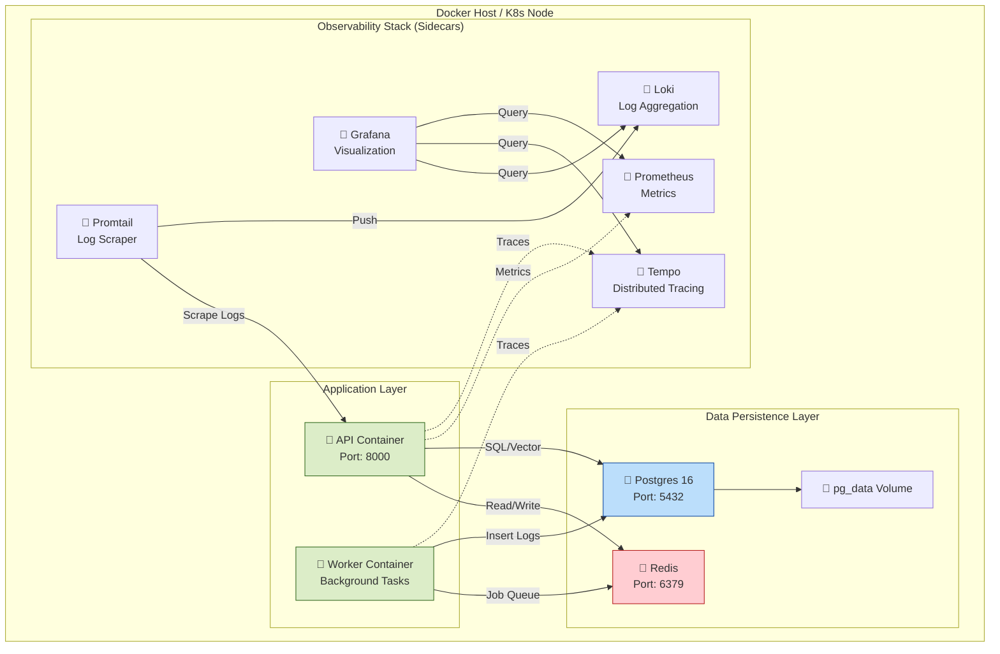

# Infrastructure & Deployment View

This diagram depicts the containerized architecture as defined in `docker-compose.yml` (or Kubernetes manifests). It emphasizes the separation of concerns between the API, Worker, and Observability stack.

