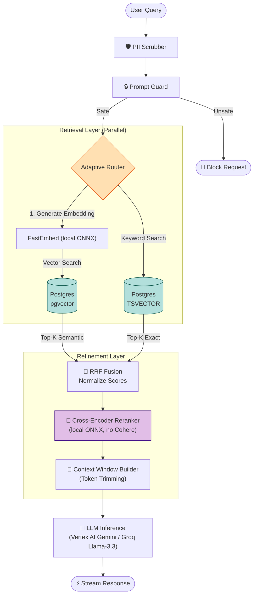

# RAG & Hybrid Search Pipeline

This diagram details the **Retrieval-Augmented Generation (RAG)** logic executed by the `AdaptiveRouter`. It showcases the "Hybrid Search" strategy (Vector + Keyword) and the "Reranking" step for maximum precision.

