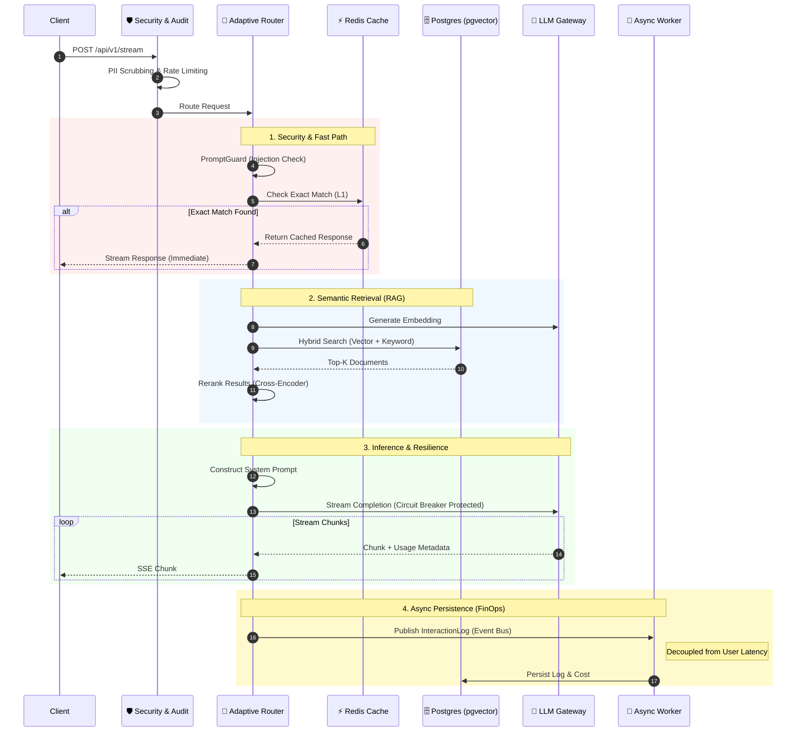

# Resilient Learning Loop (Sequence Diagram)

This diagram details the **Request Flow** within the system, highlighting the **Multi-Tier Caching** strategy, **Circuit Breakers**, and the **Async Persistence** mechanism (FinOps).

